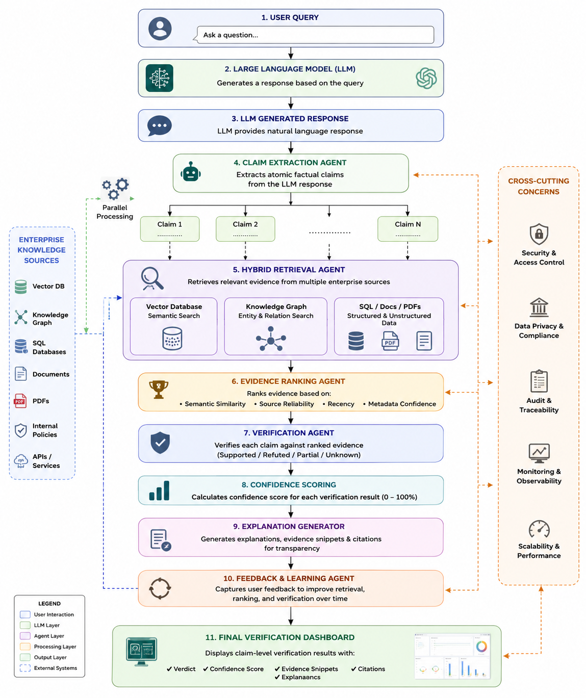
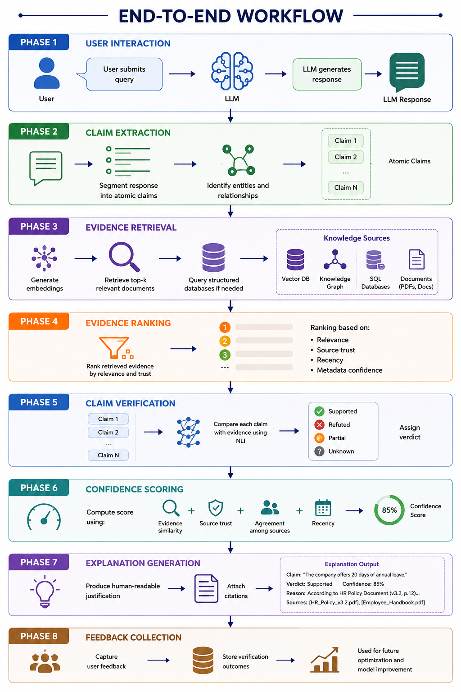

# Salesforce Compass Project

## Automated Fact-Checking and Validation Engine (Valid8)

An **Enterprise AI Trust Layer** that verifies factual claims in LLM-generated responses against trusted knowledge sources — with claim-level verdicts, confidence scores, evidence citations, and explainable reasoning.

> Post-generation verification for enterprise AI: detect hallucinations, explain decisions, and increase trust before answers reach end users.

---

## Vision

Build a reusable trust and governance layer that enhances LLM reliability by automatically verifying AI-generated responses against trusted enterprise knowledge. The long-term goal is seamless integration with platforms such as **Salesforce Agentforce**, **Einstein Copilot**, and enterprise **RAG** applications — without replacing existing LLMs or RAG pipelines.

---

## Problem

Enterprises are adopting LLMs for support, knowledge, HR, legal, finance, and healthcare workflows. Models can still produce **hallucinations** — fluent answers that are wrong or unsupported. In enterprise settings that can cause bad decisions, compliance risk, and loss of trust.

Public fact-checkers (Wikipedia / web search) are not enough: enterprise knowledge is often confidential, tenant-specific, and dynamic. Existing systems also tend to score an entire response instead of individual claims, with weak explainability for audit and compliance.

---

## Solution Overview

Valid8 implements an **Enterprise Multi-Agent Fact Verification Framework (EMVF)** that sits between the LLM and the user:

1. Decompose the LLM response into **atomic factual claims**
2. Retrieve supporting evidence from trusted knowledge sources (**hybrid retrieval**)
3. Rank evidence by relevance, trust, recency, and metadata confidence
4. Verify each claim (Supported / Refuted / Partial / Insufficient Evidence)
5. Produce **confidence scores**, explanations, and **citations**
6. Capture feedback to improve future retrieval and verification

---

## Architecture



### Core layers

| Layer | Role |
|-------|------|
| **Claim Decomposition** | Segment responses into atomic claims (entities, relations, verifiable statements) |
| **Hybrid Evidence Retrieval** | Semantic search + structured/unstructured enterprise sources |
| **Multi-Agent Verification** | Specialized agents for extraction, retrieval, ranking, verification, explanation, feedback |
| **Evidence Ranking** | Similarity, source authority, recency, metadata confidence, cross-source agreement |
| **Explainable Verification** | Verdict + score + snippets + citations + reasoning |
| **Continuous Learning** | Feedback loop to improve retrieval, ranking, and score calibration |

### Multi-agent roles

- **Claim Extraction Agent** — extract atomic claims from LLM output  
- **Evidence Retrieval Agent** — fetch top evidence from knowledge stores  
- **Evidence Ranking Agent** — prioritize reliable, relevant evidence  
- **Verification Agent** — NLI / semantic reasoning (support, contradict, partial)  
- **Explanation Agent** — human-readable justifications and citations  
- **Feedback Agent** — learn from outcomes and user feedback  

---

## End-to-End Workflow



| Phase | What happens |
|-------|----------------|
| 1. User Interaction | User submits a query; LLM generates a response |
| 2. Claim Extraction | Response → atomic claims; entities & relations identified |
| 3. Evidence Retrieval | Embeddings → top-k docs; optional structured queries |
| 4. Evidence Ranking | Rank by relevance, trust, recency, metadata confidence |
| 5. Claim Verification | NLI comparison → Supported / Refuted / Partial / Unknown |
| 6. Confidence Scoring | Similarity + trust + agreement + recency → 0–100% |
| 7. Explanation Generation | Human-readable reason + citations |
| 8. Feedback Collection | Store outcomes for continuous improvement |

---

## Tech Stack


| Layer | Technology |
|-------|------------|
| Frontend | Next.js, React.js, Tailwind CSS |
| Backend | FastAPI (REST orchestration) |
| LLM | OpenRouter / Gemini / Groq (optional OpenAI, Anthropic, DeepSeek) |
| Embeddings & Vector store | Sentence-style embeddings via pipeline + **ChromaDB** |
| Data | JSON ground-truth store (extensible to PostgreSQL / Neo4j) |
| Auth | JWT-based authentication |
| Deployment target | Docker-ready modular services |

**Design goals:** modular & scalable · high performance · hybrid retrieval · explainable & transparent · enterprise-ready.

---

## Novel Contributions

1. **Enterprise single source of truth** — verify against tenant / trusted knowledge, not only the public web  
2. **Hybrid retrieval** — semantic + keyword + structured sources  
3. **Multi-agent architecture** — modular, scalable verification pipeline  
4. **Explainable AI** — every verdict includes evidence, score, citation, and reasoning  
5. **Continuous learning** — feedback improves future accuracy  

---

## Repository structure

```
Compass Program/
├── backend/                 # FastAPI verification engine
│   ├── app/
│   │   ├── main.py          # REST API
│   │   ├── config.py
│   │   ├── models.py
│   │   └── services/        # Auth, ingestion, claim extraction, retrieval,
│   │                          verification, scoring, hallucination, etc.
│   ├── data/                # Ground-truth chunks, metadata, users
│   ├── tests/
│   ├── requirements.txt
│   └── .env.example
├── frontend/                # Next.js verification UI & dashboards
├── Architecture.png
├── Workflow.png
├── Tech Stack.png
└── Project Documentatio.pdf
```

---

## Getting started

### Prerequisites

- Python 3.10+
- Node.js 18+
- API keys for at least one LLM provider (see `.env.example`)

### 1. Backend

```bash
cd backend
python -m venv .venv

# Windows
.venv\Scripts\activate

# macOS / Linux
source .venv/bin/activate

pip install -r requirements.txt
copy .env.example .env   # then edit keys (Windows)
# cp .env.example .env   # macOS / Linux
uvicorn app.main:app --reload --port 8000
```

API docs: [http://localhost:8000/docs](http://localhost:8000/docs)

### 2. Frontend

```bash
cd frontend
npm install
npm run dev
```

App: [http://localhost:3000](http://localhost:3000)

### Environment variables

Copy `backend/.env.example` to `backend/.env` and set:

| Variable | Purpose |
|----------|---------|
| `OPENROUTER_API_KEY` | OpenRouter LLM access |
| `GEMINI_API_KEY` | Google Gemini |
| `GROQ_API_KEY` | Groq |
| `JWT_SECRET_KEY` | Auth token signing (change in production) |

Optional: `OPENAI_API_KEY`, `ANTHROPIC_API_KEY`, `DEEPSEEK_API_KEY`

---

## Development workflow (6 steps)

Delivered via `main` + feature branches and pull requests:

| Step | Branch | Adds |
|------|--------|------|
| 1 | `main` | Project scaffold (README, `.gitignore`) |
| 2 | `feature/backend-core` | Config, models, dependencies |
| 3 | `feature/auth` | Auth service and user store |
| 4 | `feature/verification-pipeline` | API, verification services, ground-truth data |
| 5 | `feature/frontend` | Next.js UI and visualizations |
| 6 | `feature/tests` | Backend unit tests |

Merge order: **2 → 3 → 4 → 5 → 6**.

---

## Team

| Member | Focus |
|--------|--------|
| **Monisha Sarai** | Research & literature survey, HLD/LLD, multi-agent architecture, FastAPI backend, claim extraction & retrieval, embeddings, React/Next frontend integration, system integration, documentation & presentation |
| **Shreya Namdeo** | Research support, FastAPI backend, retrieval pipeline, embeddings, ChromaDB, PostgreSQL connectivity, Docker, API testing & backend optimization |
| **Sindhu** | Research support, verification engine, confidence scoring, citation & explanation module, React dashboard, UI integration, system testing, performance evaluation |

---

## Expected benefits

- Claim-level verification instead of whole-response scoring  
- Verification against trusted / enterprise knowledge sources  
- Modular multi-agent design for scale and maintainability  
- Hybrid retrieval for better evidence coverage  
- Explainable reports with confidence scores and citations  
- Feedback-driven continuous improvement  
- Stronger trust, transparency, and AI governance  

---

## Documentation

- Full project write-up: [`Project Documentatio.pdf`](./Project%20Documentatio.pdf)
- Architecture diagram: [`Architecture.png`](./Architecture.png)
- Workflow diagram: [`Workflow.png`](./Workflow.png)
- Tech stack diagram: [`Tech Stack.png`](./Tech%20Stack.png)

---

## License

Proprietary — Salesforce Compass Program academic / internship project.
